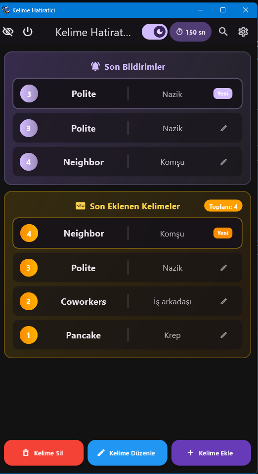
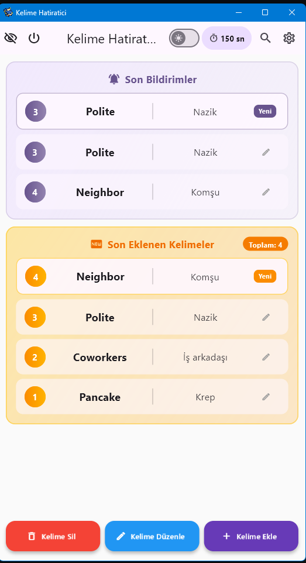
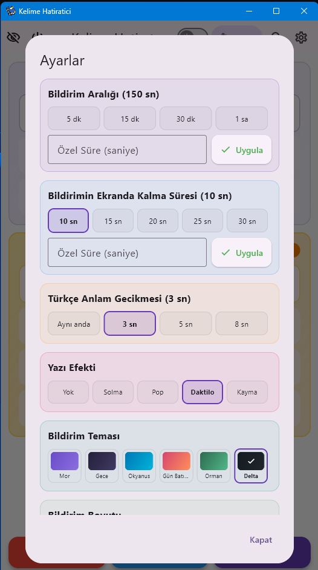
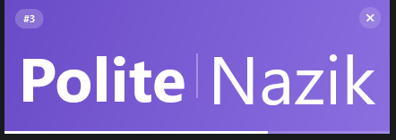
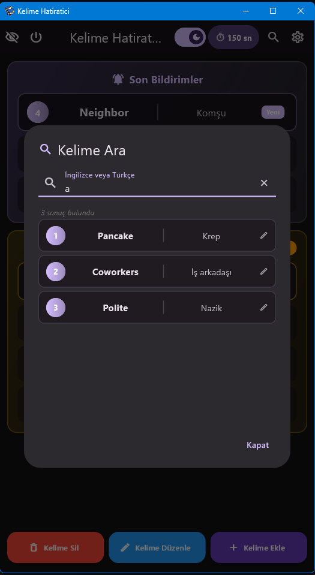
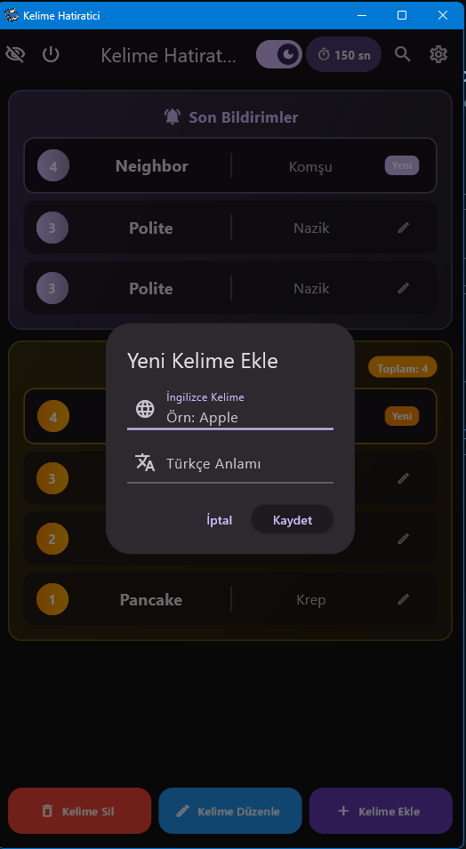

<div align="center">

# 📚 Kelime Hatırlatıcı / Word Reminder


**🇹🇷 Windows için arka planda çalışan akıllı kelime hatırlatma uygulaması**
**🇬🇧 Smart background word reminder for Windows**

<a href="https://github.com/ERKANONER23/word_reminder_v2/releases/latest/download/word_reminder_v2_windows_x64.zip">
  
</a>

> 📦 **Kurulum gerektirmez / No installation needed** — ZIP'i çıkart, `kelime_hatiratici.exe` çalıştır!

</div>

---

## 🖼️ Ekran Görüntüleri / Screenshots

<table>
  <tr>
    <td align="center">
      <b>🇹🇷 Ana Ekran (Koyu)</b><br><b>🇬 Main (Dark)</b><br>
      
    </td>
    <td align="center">
      <b>🇹🇷 Ana Ekran (Açık)</b><br><b>🇬🇧 Main (Light)</b><br>
      
    </td>
    <td align="center">
      <b>🇹🇷 Ayarlar</b><br><b>🇬🇧 Settings</b><br>
      
    </td>
  </tr>
  <tr>
    <td align="center">
      <b>🇹🇷 Bildirim</b><br><b>🇬🇧 Notification</b><br>
      
    </td>
    <td align="center">
      <b>🇹🇷 Kelime Arama</b><br><b>🇬🇧 Search</b><br>
      
    </td>
    <td align="center">
      <b>🇹🇷 Kelime Ekle</b><br><b>🇬🇧 Add Word</b><br>
      
    </td>
  </tr>
</table>

---

# 🇹🇷 TÜRKÇE

## ✨ Özellikler

- 🪟 9:16 dikey pencere (telefon görünümü)
- 🔔 Ayarlanabilir aralıklarla rastgele kelime bildirimi
- 👻 **Pasif bildirim**: odak çalmaz, imleç kıpırdamaz
- 💨 **Hover saydamlık**: fare gelince saydamlaşır, tıklama arkaya geçer
- 🎬 Kademeli akış: Panel → İngilizce → Türkçe (gecikmeli)
- ✍️ 5 yazı efekti (Yok / Solma / Pop / Daktilo / Kayma)
- 🎨 6 tema · 📏 3 boyut
- 🔍 Kelime arama (**Ctrl+F**)
- ➕ Kelime ekle / sil / düzenle
- 🗂️ CSV içe / dışa aktarma
- 💾 Otomatik yedekleme (`exe/backup`)
- 📌 Sistem tepsisi + 🚀 Windows ile otomatik başlatma
- ⌨️ Kısayollar: `Enter` = ekle · `ESC` = iptal · `Ctrl+F` = ara

## 📦 Kurulum

1. Releases'ten `word_reminder_v2_windows_x64.zip` indir
2. Çıkart
3. `kelime_hatiratici.exe` çalıştır

✅ `sqlite3.dll` pakete dahildir.

## 🛠️ Kaynaktan Derleme

```bash
git clone https://github.com/ERKANONER23/word_reminder_v2.git
cd word_reminder_v2
flutter pub get
flutter run -d windows
```
⚠️ `sqlite3.dll` dosyasını `windows/` klasörüne kopyalayın.

---

# 🇬🇧 ENGLISH

## ✨ Features

- 🪟 9:16 vertical window (phone-like)
- 🔔 Random word notifications at adjustable intervals
- 👻 **Passive notifications**: never steals focus, cursor stays put
- 💨 **Hover transparency**: fades on hover, clicks pass through
- 🎬 Staged flow: Panel → English → Turkish (with delay)
- ✍️ 5 text effects (None / Fade / Pop / Typewriter / Slide)
- 🎨 6 themes · 📏 3 sizes
- 🔍 Word search (**Ctrl+F**)
- ➕ Add / delete / edit words
- 🗂️ CSV import / export
- 💾 Auto backup (`exe/backup`)
- 📌 System tray + 🚀 Auto-start with Windows
- ⌨️ Shortcuts: `Enter` = add · `ESC` = cancel · `Ctrl+F` = search

## 📦 Installation

1. Download `word_reminder_v2_windows_x64.zip` from Releases
2. Extract it
3. Run `kelime_hatiratici.exe`

✅ `sqlite3.dll` is included.

## 🛠️ Build from Source

```bash
git clone https://github.com/ERKANONER23/word_reminder_v2.git
cd word_reminder_v2
flutter pub get
flutter run -d windows
```
⚠️ Copy `sqlite3.dll` into the `windows/` folder.

---

## 🔐 Gizlilik / Privacy

🇹🇷 Tüm veriler yereldir, internete hiçbir şey gönderilmez.
🇬🇧 All data is local; nothing is sent over the internet.

## 📜 Lisans / License

MIT — [LICENSE](LICENSE)

---

<div align="center">

**🇹🇷 Keyifli öğrenmeler! / 🇬 Happy learning!** 
⭐ Beğendiyseniz yıldız vermeyi unutmayın! / If you like it, star it!

</div>
